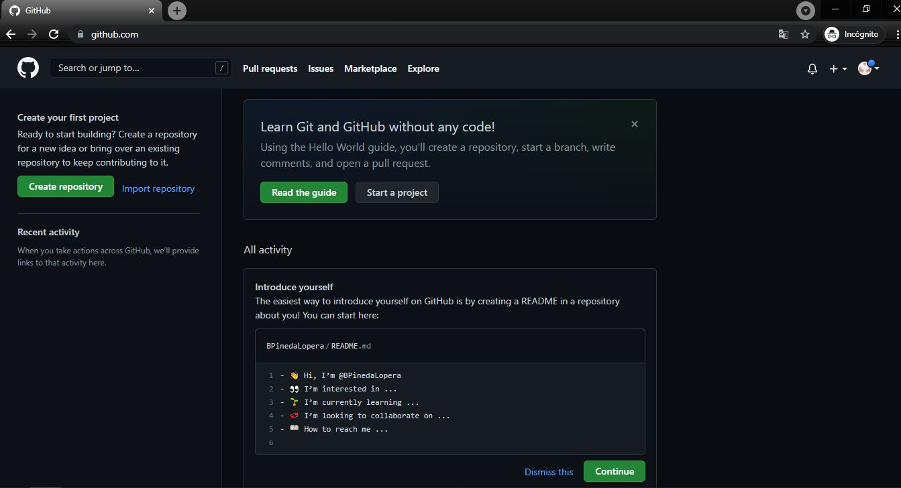
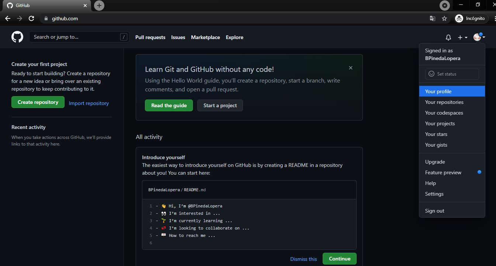
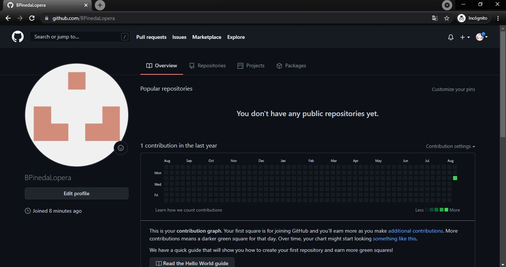

# Github Creacion de cuenta 
:octocat:

> ### Vamos a crear nuestra propia cuenta de `Github`. :scroll:
## [Github](https://github.com/) 
### INSTRUCCIONES
1. Nos dirigimos a la pagina principal de `Github` - https://github.com/.
2. Damos clic en `Sign up`.
3. Ingresamos el correo electronico con el cual crearemos nuestra cuenta de `Github`
4. Ingresamos un Password para nuestra cuenta.
5. Ingresamo el `Username` que utilizaremos para ser reconocidos de forma `UNICA` en `Github`.
    * Nuestro `Username` es unico!!! y es la forma como nos conectaremos con los demas usuarios de `Github`, Procura que sea simple y profesional. 
    * Puede llevar tu nombre y apellido o partes de este.
    * Ejemplo: `BryanCPineda`.
6. Decidimos si queremos recivir informacion sobre anuncios `(pueden elegir si (y) o no (n))`.
7. verificamos nuestra humanidad :alien:.
8. Y por ultimo damos click en `Create account`.
9. Nos deberia llegar un Correo electronico con un codigo para validar el mismo.
10. Despues de validar el correo: 
    * Nos preguntara cuantas personas trabajaran con nosotros. (pueden elegir `solo yo` o `just me`)
    * Nos preguntara si somos estudiantes o profesores. (pueden elegir `estudiante` o `student`).
11. A continuacion nos preguntara en cuales funciones especificas estamos interesados. (Podemos saltar esta parte sin elegir ninguna y `continuar` o elegir cuales llamen su atencion)
12. A continuacion nos preguntara si deseamos la version `gratuita` o la version `pro`. (elegimos la version gratuita)
13. Si llegaste a este punto deberias tener algo parecido a esto!

14. Puedes ir a tu perfil y editarlo! 

15. Preciona `Edit Profile`.
    * Escribe tu nombre Completo para reconocerte.
    * Puedes escribir una pequeña Bio sobre quien eres, tus intereses, asi los demas sabran algo sobre ti!. 
16. Si precionas en la imagen que te brinda `Github` por defecto, puedes ingresar a mas opcciones para editar tu perfil! 
    * Recuerda subir una imagen tuya para que los demas puedan reconocerte! 

### SI LLEGASTE HASTA AQUI, FELICIDADES!!! YA TIENES UNA CUENTA DE GITHUB :smile:

